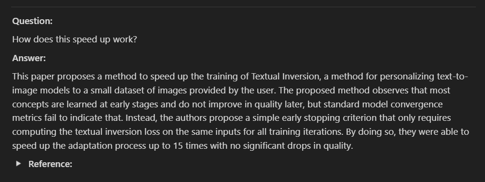

# NotionArxivChat-CLI

A few CLI tools to immersively, browse, read Arxiv paper, save to notion, chat with them and save the chat history

Resulting Notion database:

## Usage
* `arxiv_browser.py` - browse Arxiv papers in a terminal, search with arxiv query string; read abstracts. 
* `notion_arxiv_browse.py` - browse Arxiv papers in a terminal, save to Notion database (if notion API key and database id are provided)
* `notion_arxiv_browse_chat.py` - more powerful version of `notion_arxiv_browse` that allows you to download and chat with the papers and save the chat history to Notion database (if notion API key and database id are provided)

## Configuration

In the `config.yaml` file, you can configure the following parameters:
* `MAX_RESULTS_PER_PAGE` - number of results per page when browsing Arxiv papers
* `database_id` - Notion database id. Set this id when you want to save the papers to Notion database. Default is `"PUT_YOUR_DATABASE_ID_HERE"` (string) "None" or "" (empty string) will disable saving to Notion database.
* PDF_DOWNLOAD_ROOT: path to the root directory where the PDFs will be downloaded. Default is `'./pdfs'`
* EMBED_ROOTDIR: path to the root directory where the embeddings will be saved. Default is `'./embeddings'`
  * Note for windows path please use single quote string to avoid escape character issues. e.g. `'C:/Users/username/pdf'`
  * **Tips**: put the embedding and pdf in a synced folder so you can access the embedding and chat history from other devices.   

Environment variables:
* `NOTION_TOKEN` necessary for saving to Notion database. See [Notion API](https://developers.notion.com/docs/getting-started) for more details.
* `OPENAI_API_KEY` necessary for chatting with the papers. See [OpenAI API](https://beta.openai.com/docs/developer-quickstart/your-api-keys) for more details.

## Requirements

- Python 3.6+
- If you want to save to Notion database, you need:
  - [Notion](https://www.notion.so/) account, API key
- If you want to chat with the papers, you need:
  - OpenAI API key
